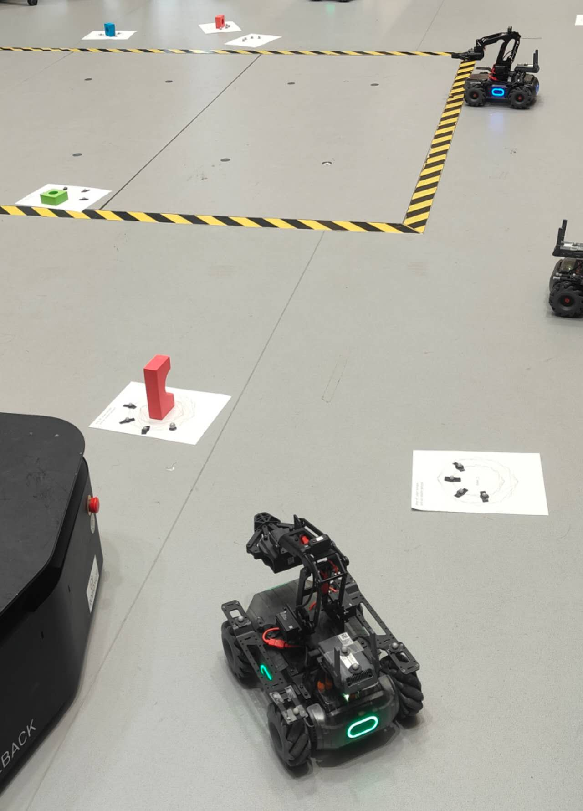
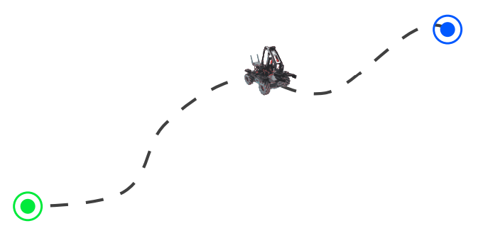
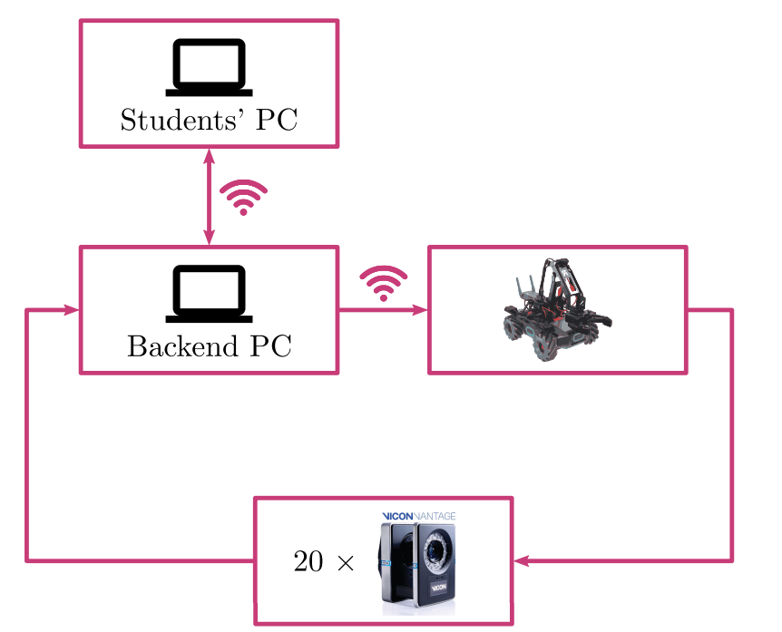
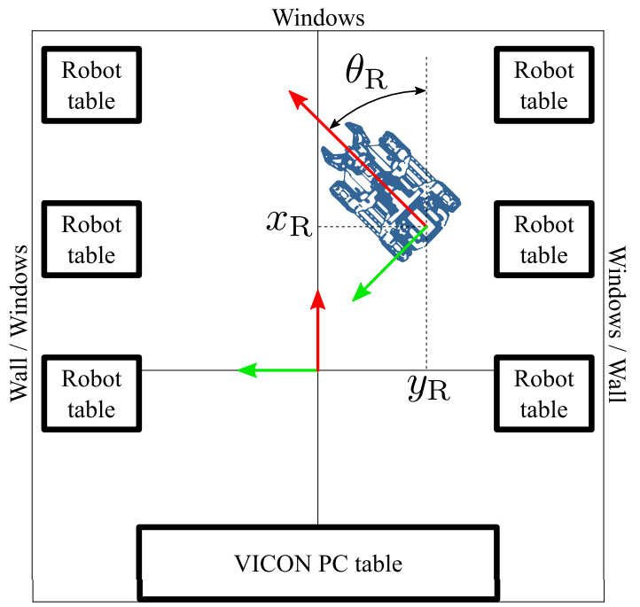

# Robot Trajectory Planning & Control in Robohub (Python 3.7+)

<p align="center">
  
  <br>
  <em>Working robot in Robohub facility</em>
</p>

<p align="center">
  
  <br>
  <em>Diagram of a generic robot path</em>
</p>

<p align="center">
  
  <br>
  <em>MQTT flow diagram & communication with backend PC, robot, and positioning cameras</em>
</p>

<p align="center">
  
  <br>
  <em>Map of Robohub facility & kinematic references</em>
</p>

## Description
Implementation of a control system for a differential-drive robot in the RoboHub facility using **Inverse Kinematics** and **PD controller**. Path planning and **MQTT-based communication** with a backend PC and many positioning cameras achieves real-time correction of perturbations in the robot's $x$ and $y$ positions and $\theta$ heading. The Inverse Kinematics equations yields a cubic spline.

### Create and activate a Python virtual environment:
```
python3 -m virtualenv robot_venv
source robot_venv/bin/activate
```
This step requires the package `virtualenv` to be installed, which can be done via `python3 -m pip install virtualenv`.

### Install latest MQTT client package, required to communicate with the backend PC & robot (send commands & receive poses):
```
python3 -m pip install --upgrade pip
python3 -m pip install --upgrade paho-mqtt
```

### Run `test.py` to test the communication with the robot:
```
python3 test.py
```

### Run `main.py` to drive the robot along the path:
```
python3 main.py
```
